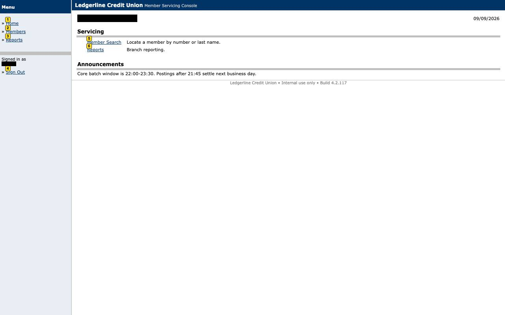
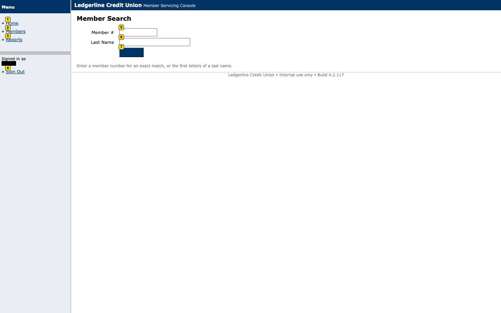
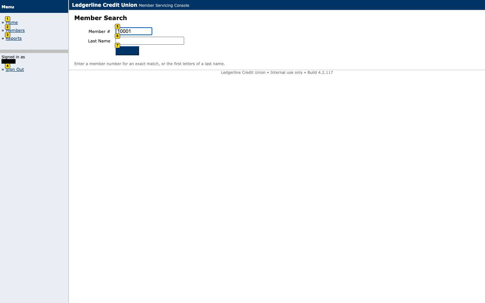
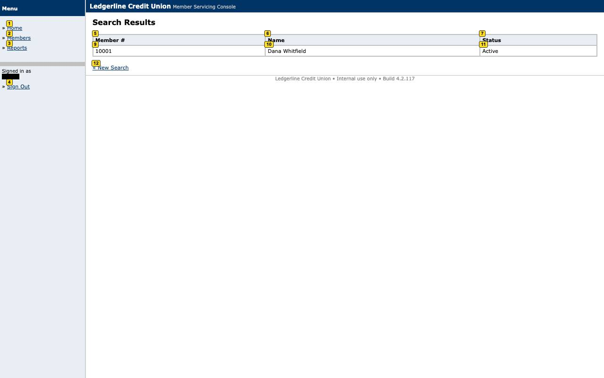
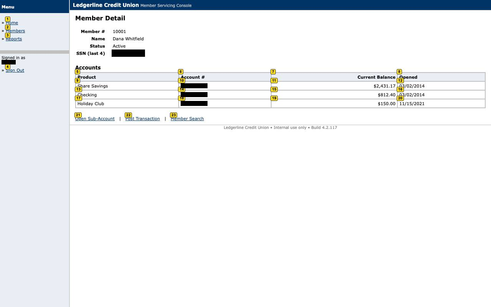

# Evidence: `discovery-read_savings_balance`

The genuine LLM-driven discovery run (Gemini) that produced the draft capability: badged+masked screenshots per turn, redacted transcript, token usage, cassette for offline replay, events with policy checks.

## Result

- **status**: `success`
- **mode**: discovery  ·  **run**: `disc_2026-09-10T05-11-24_243d`  ·  **llm_invoked**: True
- **capability**: `ledgerline.member.read_savings_balance@1.0.0` (draft)
- **goal**: Look up member 10001 and read the current balance and account number of their Share Savings account
- **params**: `{"member_id": "10001"}`
- **outputs**: `{"savings_account_number": "****1982", "savings_balance": "$2,431.17"}`

## Steps

| step | status | locator | index | ms | screenshot |
|---|---|---|---|---|---|
| s1 | ok | mark | 0 | 97 | [turn_01.jpg](screenshots/turn_01.jpg) |
| s2 | ok | mark | 0 | 56 | [turn_02.jpg](screenshots/turn_02.jpg) |
| s3 | ok | mark | 0 | 78 | [turn_03.jpg](screenshots/turn_03.jpg) |
| s4 | ok | mark | 0 | 90 | [turn_04.jpg](screenshots/turn_04.jpg) |
| s5 | ok | mark | 0 | 56 | [turn_05.jpg](screenshots/turn_05.jpg) |
| s6 | ok | mark | 0 | 53 | [turn_06.jpg](screenshots/turn_06.jpg) |

## Screenshots

### turn_01

### turn_02

### turn_03

### turn_04

### turn_05

### turn_06

### turn_07

## Files

- `cassette.json`
- `draft/ledgerline.member.read_savings_balance@1.0.0.yaml`
- `events.jsonl`
- `result.json`
- `screenshots/turn_01.jpg`
- `screenshots/turn_02.jpg`
- `screenshots/turn_03.jpg`
- `screenshots/turn_04.jpg`
- `screenshots/turn_05.jpg`
- `screenshots/turn_06.jpg`
- `screenshots/turn_07.jpg`
- `state.json`
- `transcript.redacted.json`
- `usage.json`
