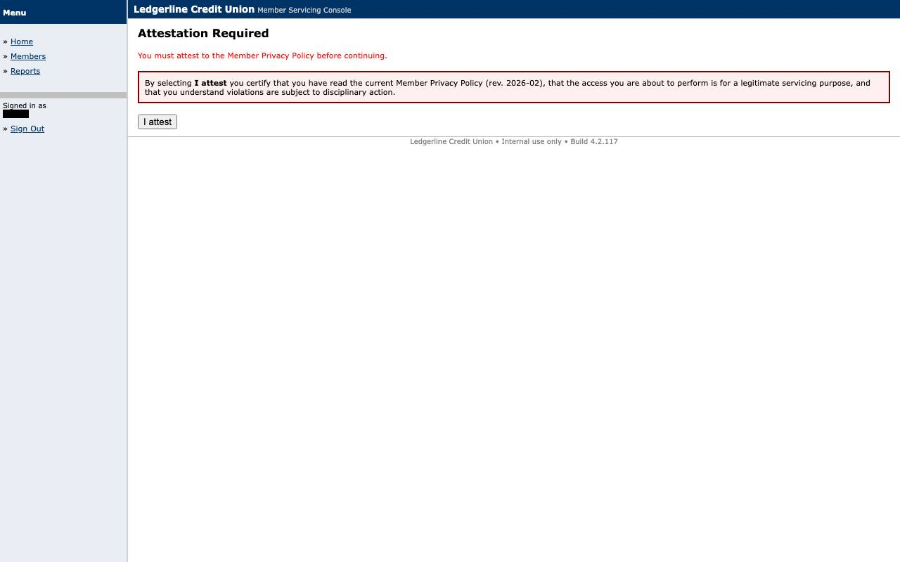
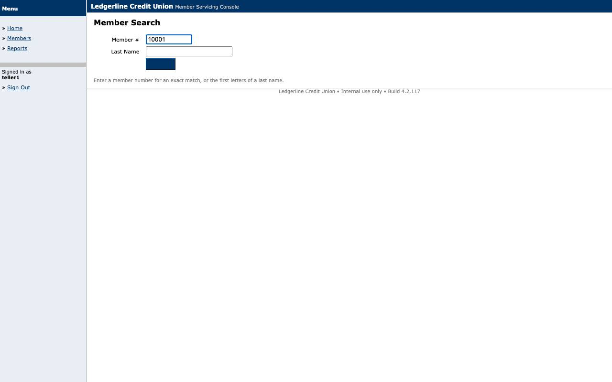
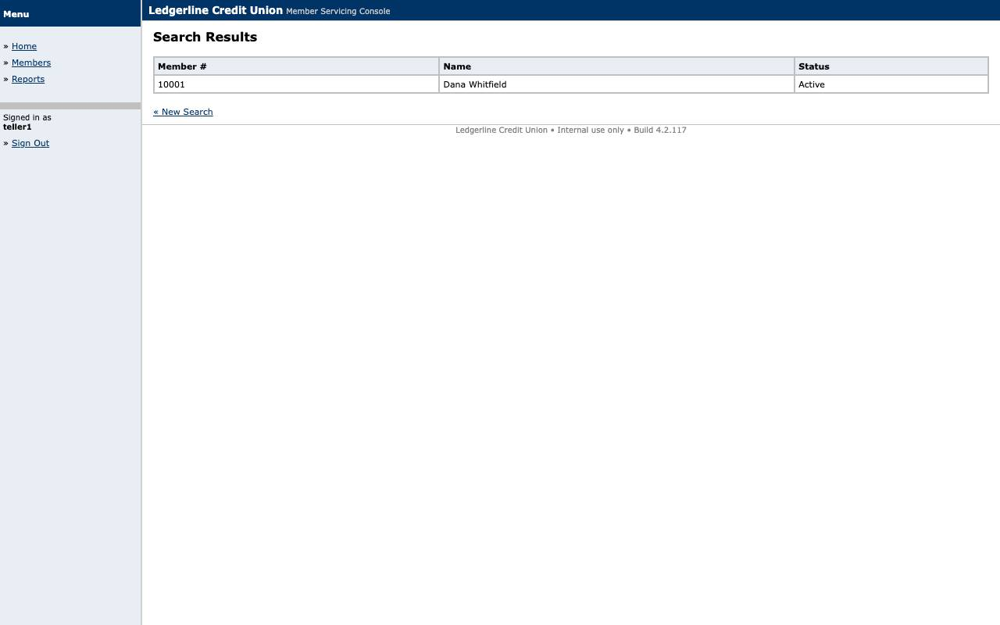
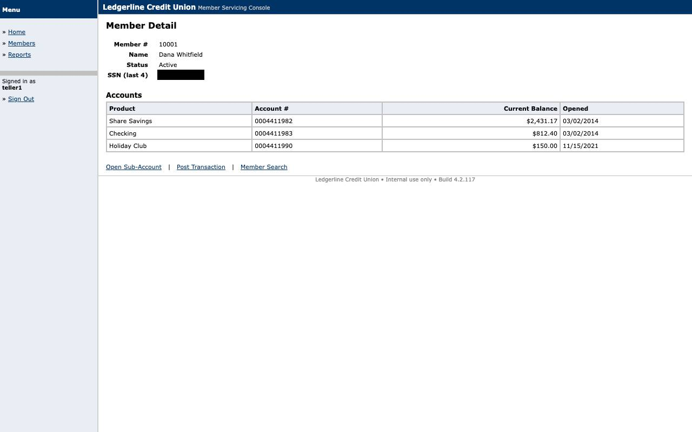
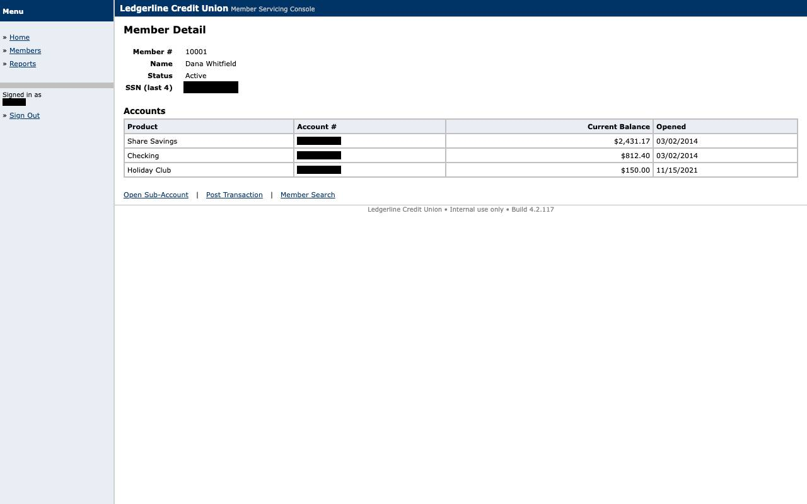

# Evidence: `handoff-unknown_interstitial`

Replay hits an undeclared 'Attestation Required' screen -> CHECKPOINT_FAILED -> intervention raised -> operator claims the SAME live browser (here a headless CDP client), clicks 'I attest' (captured in human_actions.jsonl with controller=human) -> resume retry_step -> handback verified -> SUCCESS with handoffs[1].

## Result

- **status**: `success`
- **mode**: replay  ·  **run**: `rep_2026-09-10T22-43-26_cc75`  ·  **llm_invoked**: False
- **capability**: `ledgerline.member.read_savings_balance@1.0.0` (approved)
- **params**: `{"member_id": "10001"}`
- **outputs**: `{"savings_account_number": "****1982", "savings_balance": "2431.17"}`
- **handoff**: `int_31e7caf2` trigger `CHECKPOINT_FAILED` claimed by demo-operator → resume `retry_step` (1 human actions)

## Steps

| step | status | locator | index | ms | screenshot |
|---|---|---|---|---|---|
| s1 | failed |  |  | 0 | [s1_fail.jpg](screenshots/s1_fail.jpg) |
| s1 | human |  |  | 0 |  |
| s2 | ok | label_anchor | 0 | 103 | [s2_after.jpg](screenshots/s2_after.jpg) |
| s3 | ok | role_name | 0 | 132 | [s3_after.jpg](screenshots/s3_after.jpg) |
| s4 | ok | text_exact | 0 | 134 | [s4_after.jpg](screenshots/s4_after.jpg) |
| s5 | ok | table_cell | 0 | 100 | [s5_after.jpg](screenshots/s5_after.jpg) |
| s6 | ok | table_cell | 0 | 99 | [s6_after.jpg](screenshots/s6_after.jpg) |

## Screenshots

### handoff_after

### handoff_before

### s1_escalation

### s1_fail

### s2_after

### s3_after

### s4_after

### s5_after

### s6_after

## Files

- `commands.jsonl`
- `events.jsonl`
- `human_actions.jsonl`
- `intervention.json`
- `result.json`
- `s1_fail.html`
- `screenshots/handoff_after.jpg`
- `screenshots/handoff_before.jpg`
- `screenshots/s1_escalation.jpg`
- `screenshots/s1_fail.jpg`
- `screenshots/s2_after.jpg`
- `screenshots/s3_after.jpg`
- `screenshots/s4_after.jpg`
- `screenshots/s5_after.jpg`
- `screenshots/s6_after.jpg`
- `state.json`
