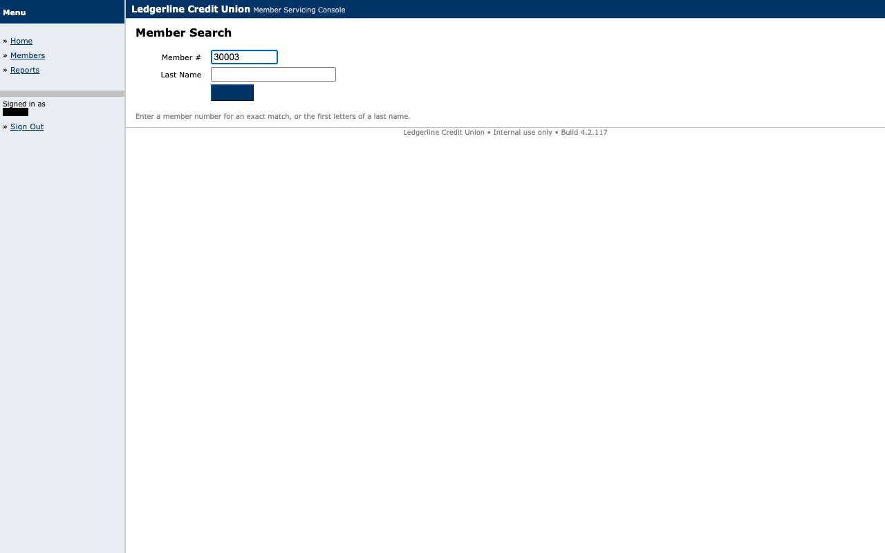
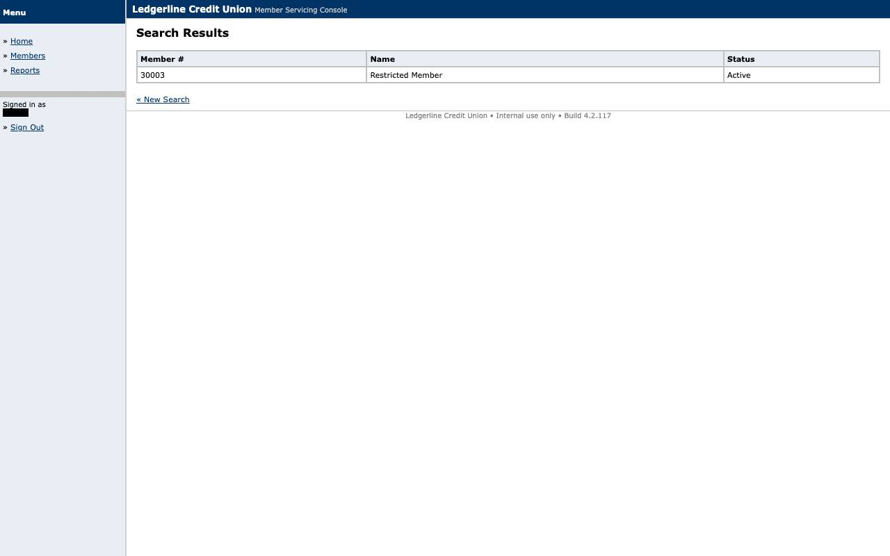
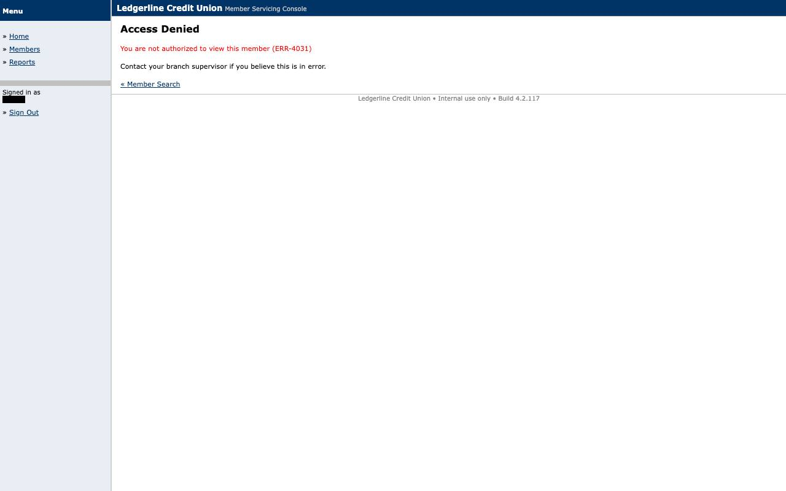

# Evidence: `replay-access_denied`

HTTP 403 at s4 is declared as BUSINESS_OUTCOME ACCESS_DENIED; the same detector at any other step would be a FAILURE (UNDECLARED_CONDITION).

## Result

- **status**: `business_outcome`
- **mode**: replay  ·  **run**: `rep_2026-09-10T22-43-09_0695`  ·  **llm_invoked**: False
- **capability**: `ledgerline.member.read_savings_balance@1.0.0` (approved)
- **params**: `{"member_id": "30003"}`
- **business outcome**: `ACCESS_DENIED` at `s4` — The operator may not view this member (restricted branch)

## Steps

| step | status | locator | index | ms | screenshot |
|---|---|---|---|---|---|
| s1 | ok | role_name | 0 | 159 | [s1_after.jpg](screenshots/s1_after.jpg) |
| s2 | ok | label_anchor | 0 | 100 | [s2_after.jpg](screenshots/s2_after.jpg) |
| s3 | ok | role_name | 0 | 132 | [s3_after.jpg](screenshots/s3_after.jpg) |

## Screenshots

### s1_after

### s2_after

### s3_after

### s4_outcome

## Files

- `events.jsonl`
- `result.json`
- `screenshots/s1_after.jpg`
- `screenshots/s2_after.jpg`
- `screenshots/s3_after.jpg`
- `screenshots/s4_outcome.jpg`
- `state.json`
