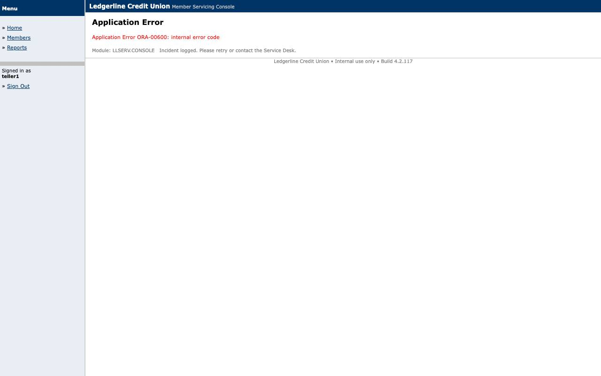

# Evidence: `replay-app_error`

Injected HTTP 500 (ORA-00600 page): hard FAILURE APP_ERROR with step, expected/observed, s1_fail.jpg and s1_fail.html; exit 20.

## Result

- **status**: `failure`
- **mode**: replay  ·  **run**: `rep_2026-09-10T05-54-49_f720`  ·  **llm_invoked**: False
- **capability**: `ledgerline.member.read_savings_balance@1.0.0` (draft)
- **params**: `{"member_id": "10001"}`
- **failure**: `APP_ERROR` at `s1` — detector 'app_error' fired at s1 with no declared disposition
  - observed: `{"url": "http://127.0.0.1:8600/console/members/search", "title": "Ledgerline Credit Union - Member Servicing Console", "http_status": 500, "dialog": null, "visible_text_head": "Menu \u00bb Home \u00bb Members \u00bb Reports Signed in as <secret> \u00bb Sign Out Ledgerline Credit Union Member Servicing Console Application Error Application Error ORA-00600: internal error code Module: LLSERV.CONS", `
  - screenshot: 
  - dom snapshot: `runs/rep_2026-09-10T05-54-49_f720/s1_fail.html`

## Steps

| step | status | locator | index | ms | screenshot |
|---|---|---|---|---|---|
| s1 | failed |  |  | 0 | [s1_fail.jpg](screenshots/s1_fail.jpg) |

## Screenshots

### s1_escalation

### s1_fail

## Files

- `events.jsonl`
- `intervention.json`
- `result.json`
- `s1_fail.html`
- `screenshots/s1_escalation.jpg`
- `screenshots/s1_fail.jpg`
- `state.json`
