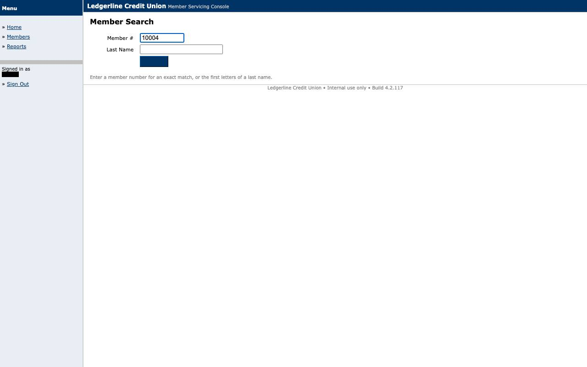
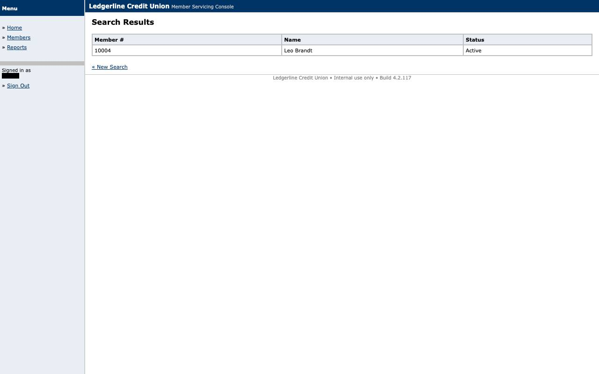
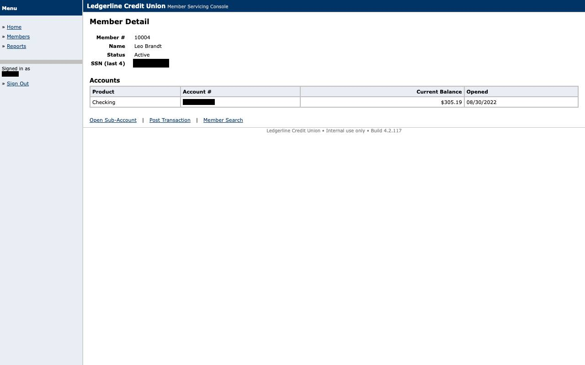

# Evidence: `replay-no_savings_account`

Member exists but holds no Share Savings: BUSINESS_OUTCOME NO_SAVINGS_ACCOUNT at s5 (none_of predicate).

## Result

- **status**: `business_outcome`
- **mode**: replay  ·  **run**: `rep_2026-09-10T22-43-11_f063`  ·  **llm_invoked**: False
- **capability**: `ledgerline.member.read_savings_balance@1.0.0` (approved)
- **params**: `{"member_id": "10004"}`
- **business outcome**: `NO_SAVINGS_ACCOUNT` at `s5` — The member exists but holds no Share Savings account

## Steps

| step | status | locator | index | ms | screenshot |
|---|---|---|---|---|---|
| s1 | ok | role_name | 0 | 160 | [s1_after.jpg](screenshots/s1_after.jpg) |
| s2 | ok | label_anchor | 0 | 99 | [s2_after.jpg](screenshots/s2_after.jpg) |
| s3 | ok | role_name | 0 | 133 | [s3_after.jpg](screenshots/s3_after.jpg) |
| s4 | ok | text_exact | 0 | 148 | [s4_after.jpg](screenshots/s4_after.jpg) |

## Screenshots

### s1_after

### s2_after

### s3_after

### s4_after

### s5_outcome

## Files

- `events.jsonl`
- `result.json`
- `screenshots/s1_after.jpg`
- `screenshots/s2_after.jpg`
- `screenshots/s3_after.jpg`
- `screenshots/s4_after.jpg`
- `screenshots/s5_outcome.jpg`
- `state.json`
