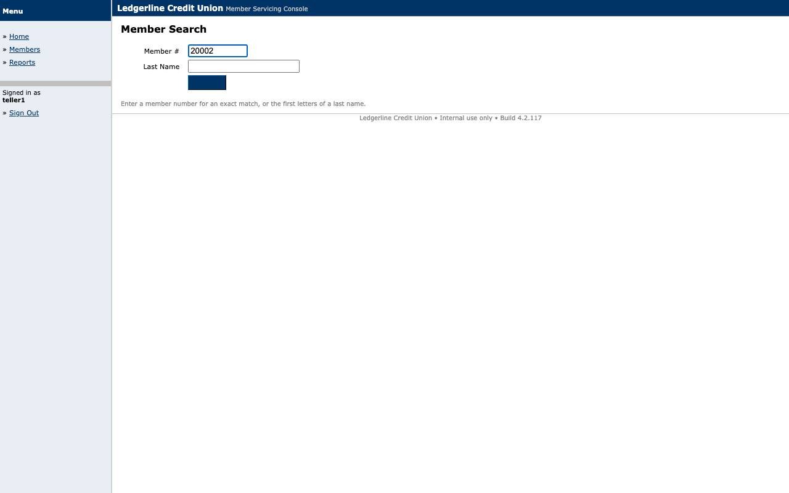
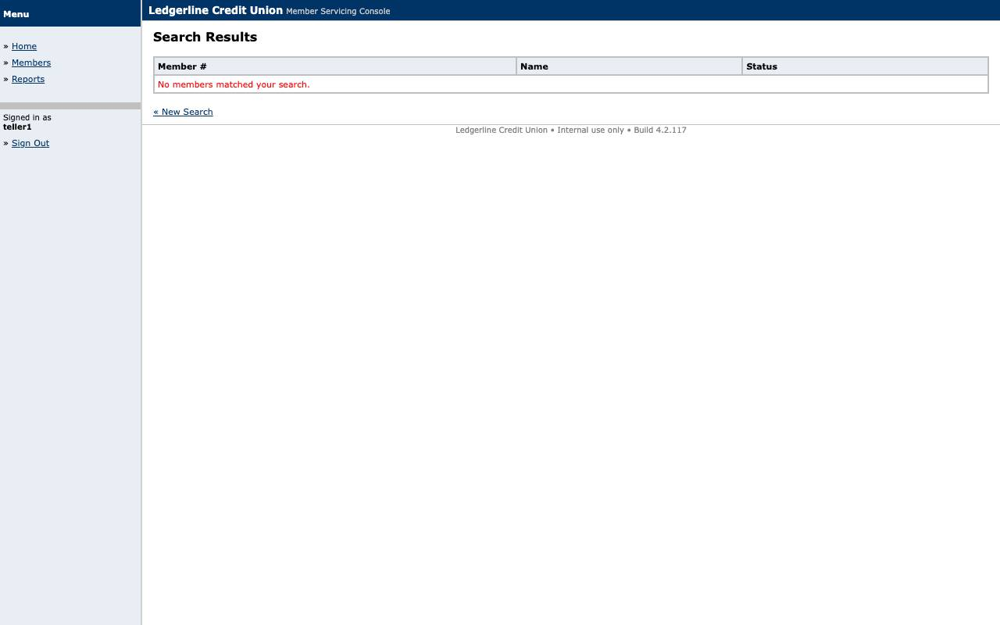

# Evidence: `replay-not_found`

'No members matched your search.' at s3 is a declared BUSINESS_OUTCOME (MEMBER_NOT_FOUND), not a failure: exit 10, returns member_id.

## Result

- **status**: `business_outcome`
- **mode**: replay  ·  **run**: `rep_2026-09-10T05-54-43_4180`  ·  **llm_invoked**: False
- **capability**: `ledgerline.member.read_savings_balance@1.0.0` (draft)
- **params**: `{"member_id": "20002"}`
- **business outcome**: `MEMBER_NOT_FOUND` at `s3` — No member exists with that member_id

## Steps

| step | status | locator | index | ms | screenshot |
|---|---|---|---|---|---|
| s1 | ok | role_name | 0 | 197 | [s1_after.jpg](screenshots/s1_after.jpg) |
| s2 | ok | label_anchor | 0 | 150 | [s2_after.jpg](screenshots/s2_after.jpg) |

## Screenshots

### s1_after

### s2_after

### s3_outcome

## Files

- `events.jsonl`
- `result.json`
- `screenshots/s1_after.jpg`
- `screenshots/s2_after.jpg`
- `screenshots/s3_outcome.jpg`
- `state.json`
