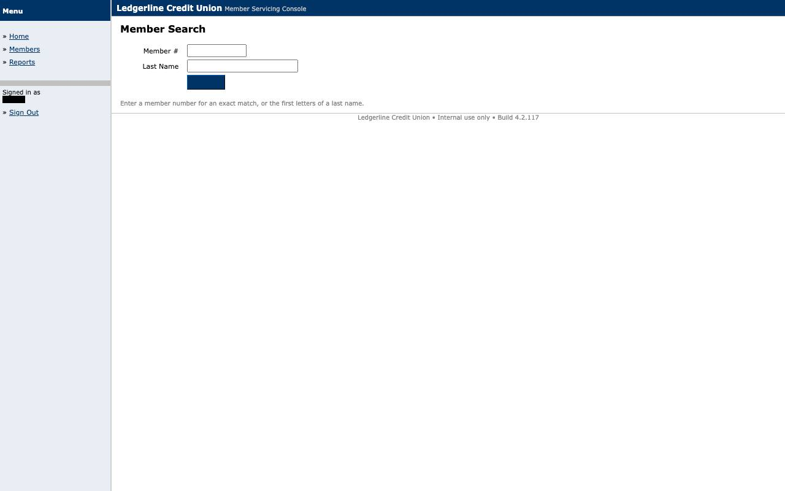

# Evidence: `replay-recovered`

Two declared, bounded recoveries in one run: Compliance Notice acknowledged (INTERSTITIAL_DISMISSED) and a 'Loading, please wait' page waited through (SLOW_LOAD_WAITED); still SUCCESS.

## Result

- **status**: `success`
- **mode**: replay  ·  **run**: `rep_2026-09-10T22-43-14_65c6`  ·  **llm_invoked**: False
- **capability**: `ledgerline.member.read_savings_balance@1.0.0` (approved)
- **params**: `{"member_id": "10001"}`
- **outputs**: `{"savings_account_number": "****1982", "savings_balance": "2431.17"}`
- **recovery**: `INTERSTITIAL_DISMISSED` (compliance_notice) at `s1`
- **recovery**: `SLOW_LOAD_WAITED` (slow_load) at `s1`

## Steps

| step | status | locator | index | ms | screenshot |
|---|---|---|---|---|---|
| s1 | ok |  |  | 0 | [s1_after.jpg](screenshots/s1_after.jpg) |
| s2 | ok | label_anchor | 0 | 114 | [s2_after.jpg](screenshots/s2_after.jpg) |
| s3 | ok | role_name | 0 | 133 | [s3_after.jpg](screenshots/s3_after.jpg) |
| s4 | ok | text_exact | 0 | 133 | [s4_after.jpg](screenshots/s4_after.jpg) |
| s5 | ok | table_cell | 0 | 100 | [s5_after.jpg](screenshots/s5_after.jpg) |
| s6 | ok | table_cell | 0 | 99 | [s6_after.jpg](screenshots/s6_after.jpg) |

## Screenshots

### s1_after

### s2_after

### s3_after

### s4_after

### s5_after

### s6_after

## Files

- `events.jsonl`
- `result.json`
- `screenshots/s1_after.jpg`
- `screenshots/s2_after.jpg`
- `screenshots/s3_after.jpg`
- `screenshots/s4_after.jpg`
- `screenshots/s5_after.jpg`
- `screenshots/s6_after.jpg`
- `state.json`
